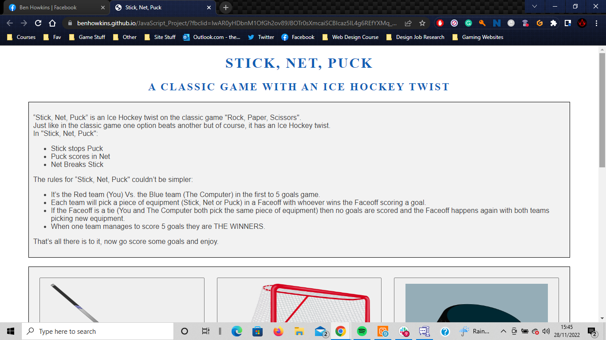
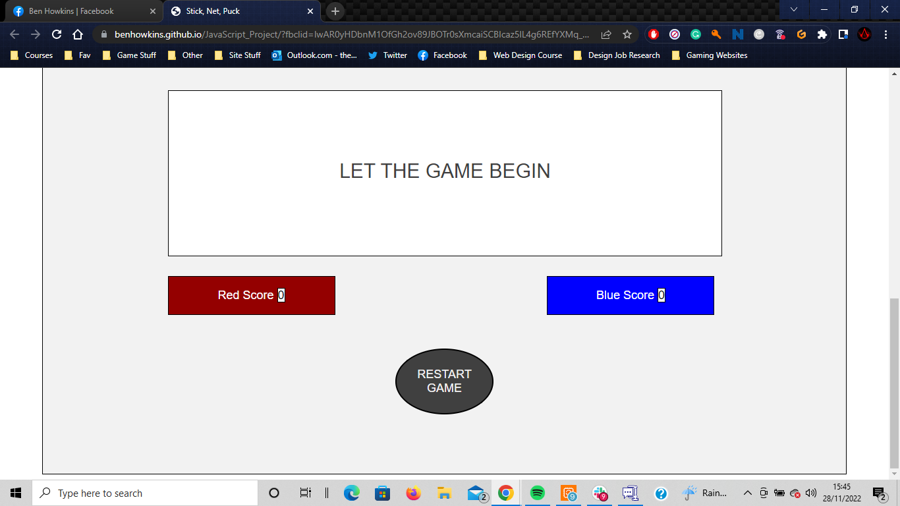
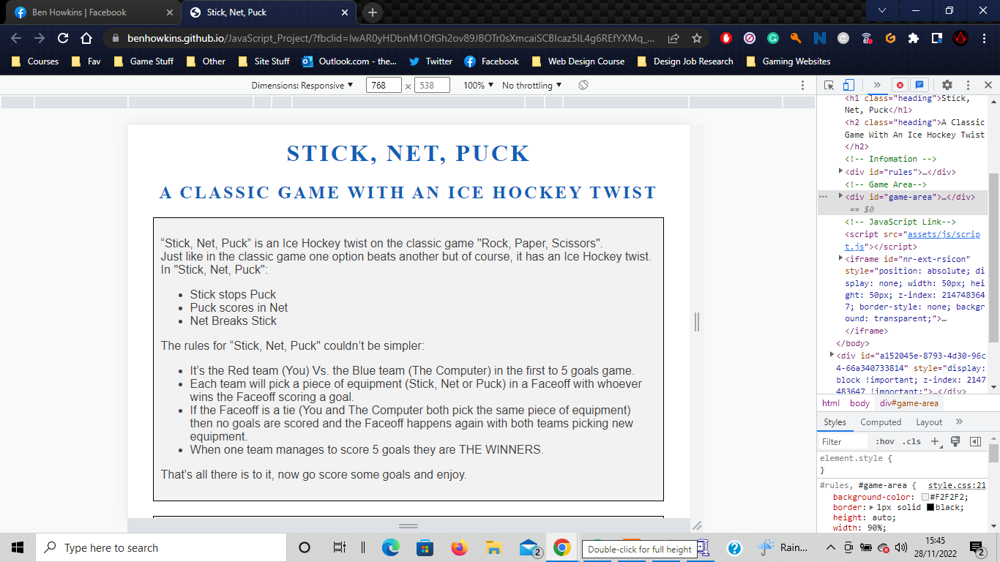
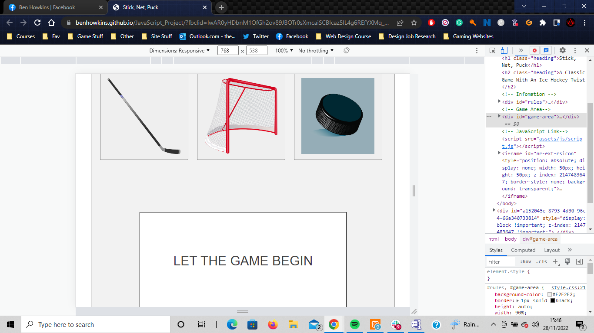
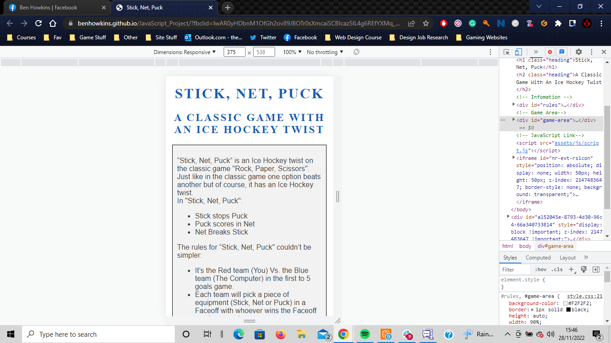
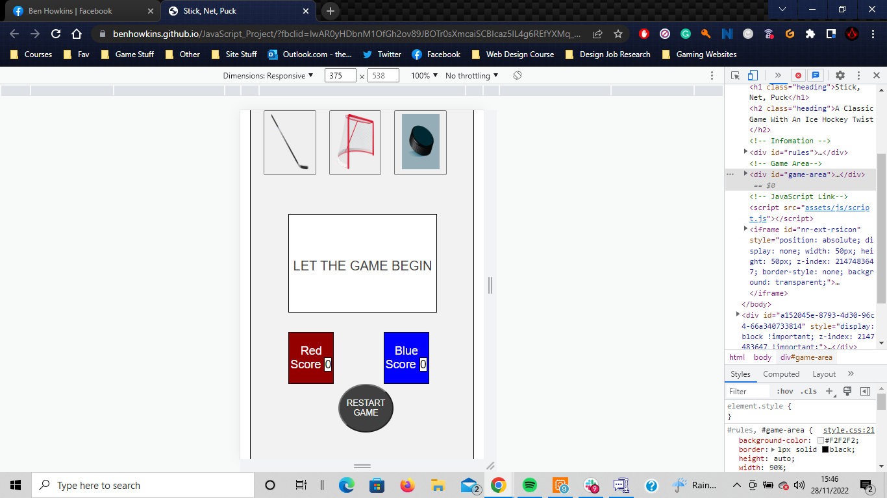
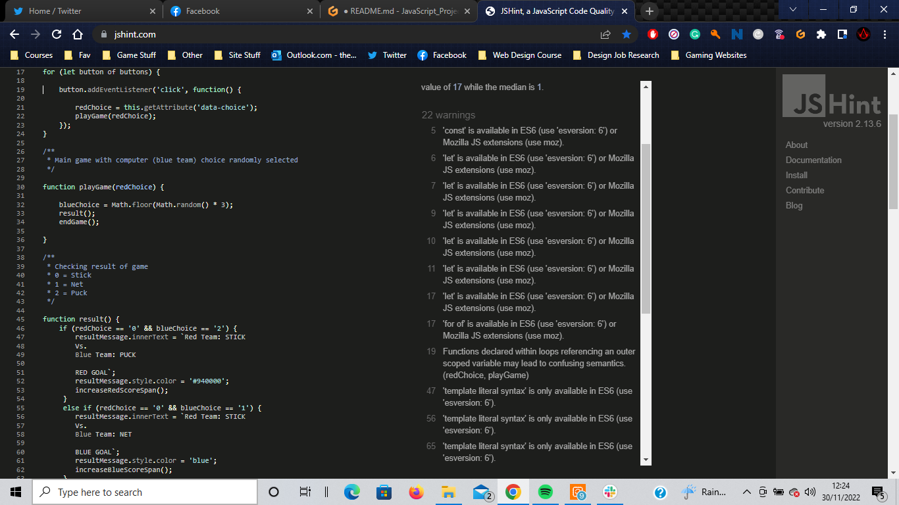
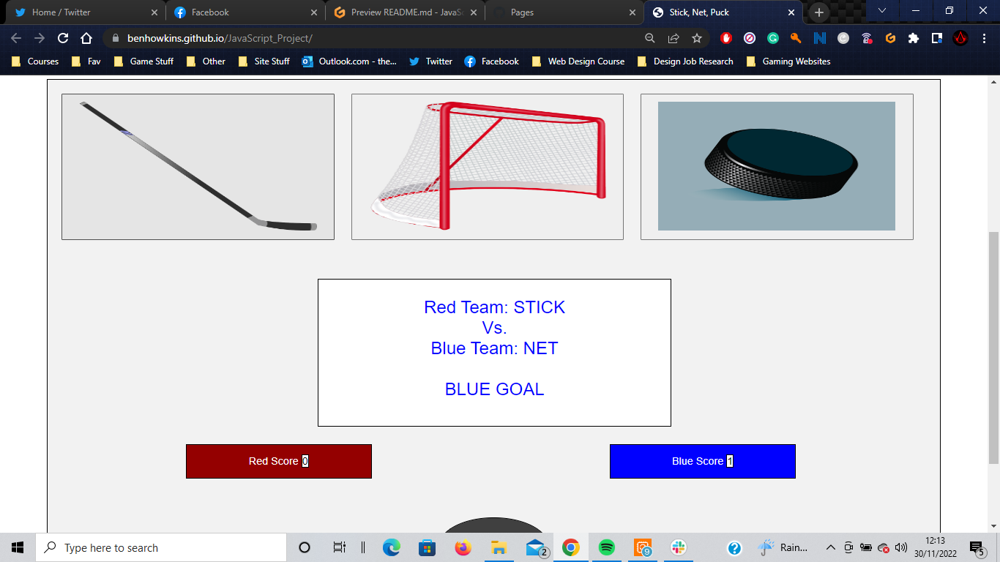
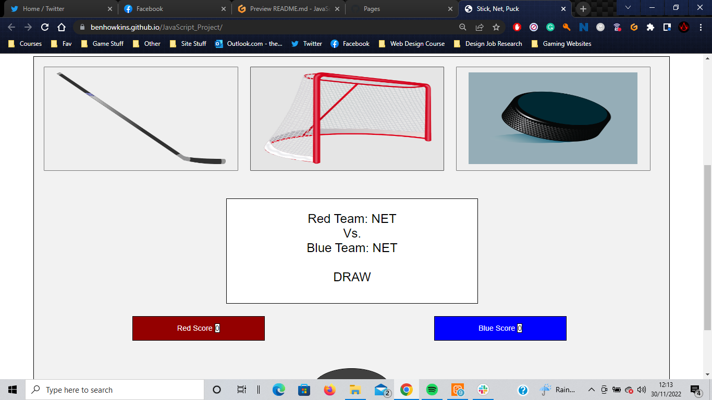
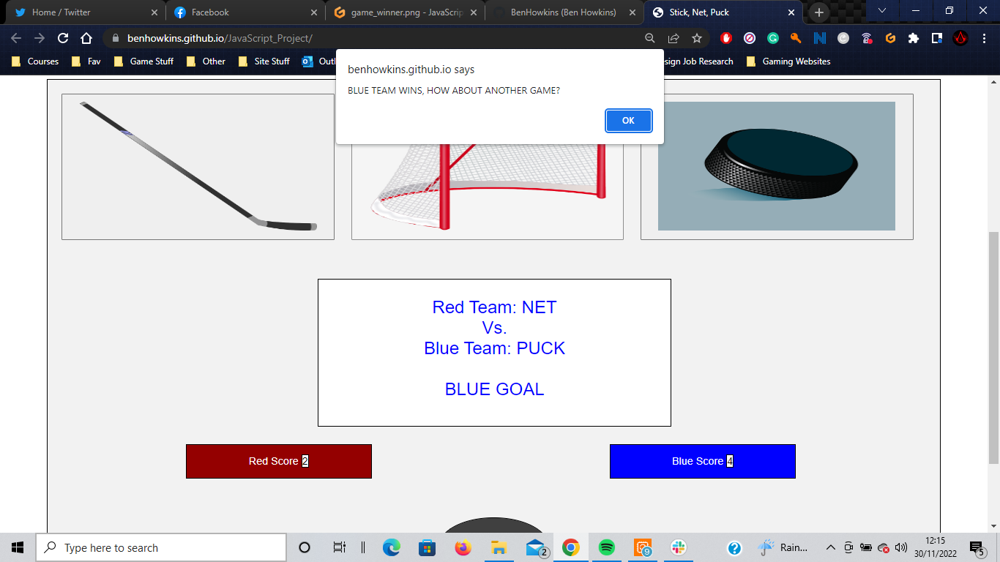

<h1 align="center">Stick, Net, Puck</h1>

[View the live project here.](https://benhowkins.github.io/JavaScript_Project/?fbclid=IwAR0yHDbnM1OfGh2ov89JBOTr0sXmcaiSCBIcaz5lL4g6REfYXMq_3Ivfk9Q)

This is a "Rock, Paper, Scissors" style JavaScript game using Ice Hockey equipment. It's designed to be playable on multiple devices of different sizes.









## User Experience (UX)

-   ### User stories

    -   #### First-Time Visitor Goals

        1. As a First Time Visitor, I want to easily understand the main purpose of the site and how to use it properly.
        2. As a First Time Visitor, I want to be able to easily start playing the game once I've read and understood the rules.
        3. As a First Time Visitor, I want to be able to know the scores and when I have either won or lost.

    -   #### Returning and Frequent Visitor Goals

        1. As a Returning Visitor, I want to be able to quickly and easily start a new game whenever I start the page.

-   ### Design
    -   #### Colour Scheme
        -   The main colours used for the text are Charcoal Grey and Light Blue. This is because they are both related to Ice Hockey as Charcoal Grey is very similar to the colour of a puck and the Light Blue is similar to the Blue lines on the rink.
        -   The background for the "Rules" and "Game" areas of the page is a Light Grey colour. This is colour is used as it doesn't clash with the Charcoal Grey of the text and it also helps to emphasise these two important areas of the page.
        -   There is a Dark Red and Blue colour used for the background of each team's score counter as well as their text in the "Results Box" when they "score". 
    -   #### Typography
        -   The Raleway font is the main font used for the Text on the website and Abyssinica SIL is used for the Headings. They also have Sans Serif and Serif respectively as their fallback fonts in the case for any reason they aren't imported into the site correctly. I used these as they are clean fonts I have used before, so I feel they are both attractive and appropriate.
    -   #### Imagery
        -   Imagery is important. There are three main images on the page: A Hockey Stick, A Hockey Net and A Hockey Puck. These are used to illustrate the choices available to the player as well as the buttons to play the game with.

## Features

-   Responsive on all device sizes

-   Interactive elements

## Technologies Used

### Languages Used

-   [HTML5](https://en.wikipedia.org/wiki/HTML5)
-   [CSS3](https://en.wikipedia.org/wiki/Cascading_Style_Sheets)
-   [JavaScript](https://en.wikipedia.org/wiki/Javascript)

### Frameworks, Libraries & Programs Used

1. [Google Fonts:](https://fonts.google.com/)
    - Google fonts were used to import the 'Titillium Web' font into the style.css file which is used on all pages throughout the project.
1. [Git](https://git-scm.com/)
    - Git was used for version control by utilizing the Gitpod terminal to commit to Git and Push to GitHub.
1. [GitHub:](https://github.com/)
    - GitHub is used to store the projects code after being pushed from Git.
1
## Testing

The W3C Markup Validator and W3C CSS Validator Services were used to validate the project to ensure there were no syntax errors in the project.

-   [W3C Markup Validator](https://jigsaw.w3.org/css-validator/#validate_by_input) - [Results](https://validator.w3.org/nu/?doc=https%3A%2F%2Fbenhowkins.github.io%2FJavaScript_Project%2F)
-   [W3C CSS Validator](https://jigsaw.w3.org/css-validator/#validate_by_input) - [Results](https://jigsaw.w3.org/css-validator/validator?uri=https%3A%2F%2Fbenhowkins.github.io%2FJavaScript_Project%2F&profile=css3svg&usermedium=all&warning=1&vextwarning=&lang=en)

-  The Markup Validator came back with no errors but the CSS Validator comes back with one error. However, the error rose isn't to do with the CSS code but is actually a Java error with the Google Font's API, which is out of my control and the actual CSS code itself comes back with no errors.

The JSHint service was used to see if there were any errors in the JavaScript code.

-   [JSHints](https://jshint.com/)


-  Upon using the service I received no error messages. I received 22 warnings.
-  12 of these warnings were the same warning, stating that keywords "let", "const" and "for of" which I used to define variables were only available on some versions of certain browsers.
-  9 of these warnings were the same warning, stating that "template literal syntax" which I used to write the results to the "Results Message" box was only available on some versions of certain browsers.
-  The last warning I received was for line 19 of my JavaScript which stated that "Functions declared within loops referencing an outer scoped variable may lead to confusing semantics". However as this line is the event listener for the player's selection, its value depends on which button they push, so can't be a fixed variable and can safely be called by this method. 

### Testing User Stories from User Experience (UX) Section

-   #### First-Time Visitor Goals

    1. As a First Time Visitor, I want to easily understand the main purpose of the site and how to use it properly.

        1. When the site loads the first thing that is seen by the visitor is the name of the game and a short description of the game.
        2. The first block of text is a summary of the game and its rules.
        
        3. This "Rules" area is in a bordered container with a coloured background so it stands out to the visitor as important.

    2. As a First Time Visitor, I want to be able to easily start playing the game once I've read and understood the rules.

        1. Underneath the "Rules" area there is another bordered, coloured area containing all of the elements of the game.
        
        2. At the top of the "Game" area is three pictures, one representing each of the available choices outlined in the "Rules".
        3. When the player makes their choice and clicks on one of the pictures the game will begin.
        

    3. As a First Time Visitor, I want to be able to know the scores and when I have either won or lost.
        
        1. Upon selecting your choice, a message will appear in the "Results Message" box in the "Game" area stating both the Red and Blue team's choices as well as the result of the match-up.
        
        
        2. Depending on the result either the Red or Blue team's score span will increase or if the matchup is a draw neither will increase.
        
        3. Upon a team receiving 5 "Goals" an alert will appear stating the winner and resets the game back to its default to start the process again.
        

-   #### Returning Visitor Goals

    1. As a Returning Visitor, I want to be able to quickly and easily start a new game whenever I start the page.

        1. The design of the page is set up so that upon loading, the game is ready to play by default. All the player needs to do is scroll to the "Game" area and select their first choice.
        
        


### Further Testing

-   The Website was tested on Google Chrome, Microsoft Edge and Firefox browsers.
-   The website was viewed on a variety of devices such as Desktop, Laptop, Kindle Fire Tablets, iPhone 12 and Huawei Pro30.
-   A large amount of testing was done to ensure that all pages were linking correctly.
-   Friends and family members were asked to review the site and documentation to point out any bugs and/or user experience issues.


### Issues Arose During Testing

-   The "Game Results" message upon pushing the "Restart Game" button wouldn't revert to its original black text and instead would stay the same colour as the last team to score and would require a second press of the button to reset completely. This issue was corrected when adding the alert message when the game is won and automatically resetting the game after the message is closed instead of having the player manually do it themselves.
-   When a team scores 5 points and the game is won a message would appear in the "Game Results" message box saying which team had won but it was possible to continue the game after this point. This was fixed by having an alert message pop up instead of the message in the "Game Results" box and having an automatic reset when the alert closes.

## Deployment

### GitHub Pages

The project was deployed to GitHub Pages using the following steps...

1. Log in to GitHub and locate the [GitHub Repository](https://github.com/BenHowkins/JavaScript_Project)
2. At the top of the Repository (not top of page), locate the "Settings" Button on the menu.
    - Alternatively Click [Here](https://raw.githubusercontent.com/) for a GIF demonstrating the process starting from Step 2.
3. Scroll down the Settings page until you locate the "GitHub Pages" Section.
4. Under "Source", click the dropdown called "None" and select "Master Branch".
5. The page will automatically refresh.
6. Scroll back down through the page to locate the now published site [link](https://benhowkins.github.io/JavaScript_Project/?fbclid=IwAR0yHDbnM1OfGh2ov89JBOTr0sXmcaiSCBIcaz5lL4g6REfYXMq_3Ivfk9Q) in the "GitHub Pages" section.

### Forking the GitHub Repository

By forking the GitHub Repository we make a copy of the original repository on our GitHub account to view and/or make changes without affecting the original repository by using the following steps...

1. Log in to GitHub and locate the [GitHub Repository](https://github.com/BenHowkins/JavaScript_Project)
2. At the top of the Repository (not top of page) just above the "Settings" Button on the menu, locate the "Fork" Button.
3. You should now have a copy of the original repository in your GitHub account.

### Making a Local Clone

1. Log in to GitHub and locate the [GitHub Repository](https://github.com/BenHowkins/JavaScript_Project)
2. Under the repository name, click "Clone or download".
3. To clone the repository using HTTPS, under "Clone with HTTPS", copy the link.
4. Open Git Bash
5. Change the current working directory to the location where you want the cloned directory to be made.
6. Type `git clone`, and then paste the URL you copied in Step 3.

```
$ git clone https://github.com/BenHowkins/JavaScript_Project
```

7. Press Enter. Your local clone will be created.

```
$ git clone https://github.com/BenHowkins/JavaScript_Project
> Cloning into `CI-Clone`...
> remote: Counting objects: 10, done.
> remote: Compressing objects: 100% (8/8), done.
> remove: Total 10 (delta 1), reused 10 (delta 1)
> Unpacking objects: 100% (10/10), done.
```

Click [Here](https://help.github.com/en/github/creating-cloning-and-archiving-repositories/cloning-a-repository#cloning-a-repository-to-github-desktop) to retrieve pictures for some of the buttons and more detailed explanations of the above process.

## Credits

### Code

-   The Stick, Net and Puck images code came from this [Pixabay](https://pixabay.com/)

### Content

-   All content was written by the developer.

-   Psychological properties of colours text in the README.md was found [here](http://www.colour-affects.co.uk/psychological-properties-of-colours)

### Media

-   All Images were created by the developer.

### Acknowledgements

-   My Mentor for continuous helpful feedback.

-   Tutor support at Code Institute for their support.
